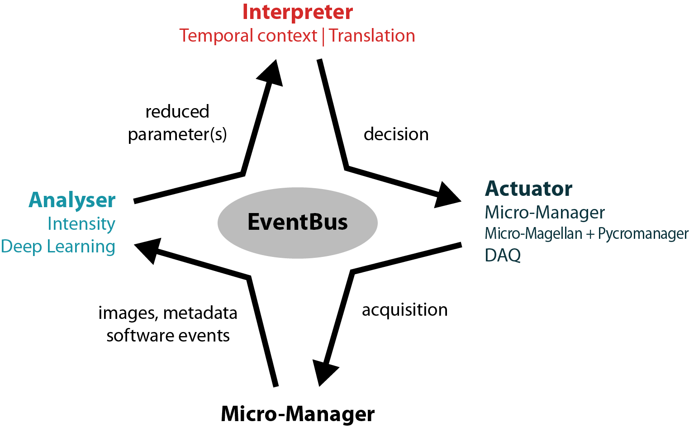

===============================
Event-driven acquisitions loops
===============================

EDA loops consist of three main components:

* :ref:`analysers`
* :ref:`interpreters`
* :ref:`actuators`

Additionally there is a communication hub to allow for communication between the components while
keep them independent and modular. The implementations described here additionally rely to different
levels on Micro-Manager for microscope control.

EventBus
--------
:py:class:`.EventBus`
Communication between the components is realized using pyqtSignals and pyqtSlots. Components can
connect to the signals directly on the EventBus
(``event_bus.new_image_event.connect(self.start_analysis)``). They can post on the EventBus by
connecting their own signals to the corresponding signals on the EventBus
(``self.new_decision_parameter.connect(event_bus.new_decision_parameter)``). See how the components
are initialized with the EventBus at :ref:`customloop`

The communication between Micro-Manager and the EventBus is realized thanks to `pycro-manager
<https://github.com/micro-manager/pycro-manager/>`_.
:py:class:`.EventThread` and :py:class:`.EventListener` connect to the PythonEventServer plugin
started in Micro-Manager. For the Actuator implementation based on pycro-manager Acquisitions (:py:class:`.PycroAcquisition`), this is achieved directly by pycro-manager
and Micro-Magellan.

.. _analysers:

Analysers
---------
:py:mod:`eda_plugin.analysers`, :py:mod:`.examples.analysers`

Accepting events:
:py:meth:`acquisition_started_event`, :py:meth:`new_image_event`, :py:meth:`mda_settings_event`

Emitting events:
:py:meth:`new_decision_parameter`

.. _interpreters:

Interpreters
------------
:py:mod:`eda_plugin.interpreters`, :py:mod:`.examples.interpreters`

Accepting events:
:py:meth:`new_decision_parameter`

Emitting events:
:py:meth:`new_interpretation`

.. _actuators:

Actuators
---------
:py:mod:`eda_plugin.actuators`, :py:mod:`.examples.actuators`

Accepting events:
:py:meth:`new_interpretation`, :py:meth:`acquisition_ended_event`
