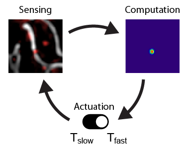

Welcome to event driven acquisition!
====================================

.. note::

   This documentation is a work in progress.

**Event-driven-acquisition** (EDA) is a Python library is a Python library for advanced microscope
control routines to enable acquisitions to react to specific biological events of interest.

More information on the project it was first used on can be found in the `bioRxiv
article <https://www.biorxiv.org/content/10.1101/2021.10.04.463102v1>`_.

Check out the :doc:`usage` section for further information, including
how to install the project (:ref:`install`).

.. raw:: html

   <video controls width=720 src="https://vimeo.com/678707620" type="video/mp4" preload="none"> "Video" </video>

.. note::

   This project is under active development.

Contents
--------

.. toctree::
   :maxdepth: 2

   usage
   examples
   custom_loop
   custom_components
   api
