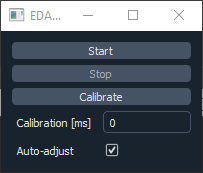

Usage
=====

.. _installation:

Installation
------------

1) Install using pip:

.. code-block:: console

   (.venv) $ pip install eda_plugin

2) Install the latest release of `micro-manager2.0 <https://micro-manager.org/wiki/Micro-Manager_Nightly_Builds>`_
3) Install the Micro-Manager plugins:

>>> import eda_plugin
>>> eda_plugin.install_mm_plugins()
# Choose the main Micro-Manager folder in the file dialog (e.g. C:\Program Files\Micro-Manager-2.0)

4) Run micro-manager with the zmq server (Tools -> Options -> Run server on port 4827) (`pycromanager installation <https://github.com/micro-manager/pycro-manager/blob/master/README.md>`_)
5) Run the PythonEventServer from Plugins -> Developer Tools -> Python Event Server

Note: This installation does not include tensorflow needed for analysers using neural networks.
Please refer to :ref:`tensorflow installation <tensorflow_installation>` to set your system up.

Running the test environment
----------------------------
With Micro-Manager, the zmq server and PythonEventServer open, run the test environment from the
examples:

>>> import eda_plugin
>>> eda_plugin.examples.main.basic()

**Camera settings**

If you are in the Demo configuration of Micro-Manager, acquisitions will normally result in a moving
stripe pattern. The analyser in this basic implementation uses the intensity of the first pixel, so
the readout will also be a wave. If you start an acquisition from the MDA window, you should see the
range of values in the main plot. If the frequency of the wave pattern is very high, you can set
Devices -> Device Property Browser -> Camera-StripeWidth to a smaller value.

.. video:: _static/StripeWidth.mp4
   :width: 720

**Calibration**

The actuator pauses acquisition to match the requested interval. After each interval it opens
acquisition to acquire one timepoint. To be flexible for many systems, the time to open acquisition
can be calibrated using the Calibration button. The EDA-plugin triggers a 5 timepoint acquisition
and calculates the time to open acquisition from the image arrival times. During acquisition, this
value will be further adjusted if the auto-acquisition checkbox is checked. So ideally let it adjust
for one more acquisition and when the value does not increase further, uncheck.

**Acquisition**

If you start acquisition from the Actuator GUI, EDA will be active. Set the thresholds to be in the
range that you have observed for the analyser to be in. Set the thresholds to somewhere in that
range and click the Start button.
